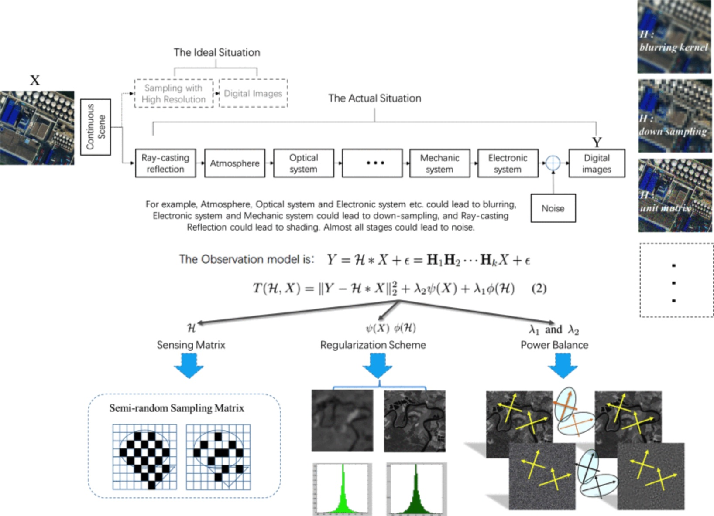

# J-STARS'24 Semiblind Compressed Sensing: A Bidirectional-Driven Method for Spatiotemporal Fusion of Remote Sensing Images

This is the official pytorch implementation of [Semiblind Compressed Sensing: A Bidirectional-Driven Method for Spatiotemporal Fusion of Remote Sensing Images](https://ieeexplore.ieee.org/abstract/document/10696963/) (SDCS) (J-STARS 2024)


<hr />

> **Abstract:** *Spatiotemporal remote sensing imaging is one of the most important ways to continuously monitor the Earth. Due to some technical limitations, it is still not easy to obtain images with high-temporal-high-spatial resolution. In this article, we propose a new spatiotemporal remote sensing image fusion method with semiblind deep compressed sensing (SDCS). The reconstruction by SDCS includes two stages: compressed sensing observation and deep post processing. In the stage of CS observation, we design a sensing matrix to connect two spatiotemporal sequences. It can make sure that both the RIP condition of CS and the correspondence of spatiotemporal features are satisfied at the same time, and then CS observation provides a good initial estimates. In the stage of deep postprocessing, it is data-driven, and we designed a deep CNN architecture with multivariate activation function. The second stage not only smoothes out the noise but also reduces the errors from unprecise sampling matrix and compensates for the image differences caused by different imaging conditions. The proposed method is tested on two Landsat and MODIS datasets. Some of state-of-the-art algorithms are comprehensively compared with the proposed SDCS. The experiment results and ablation analysis confirm the better performances of the proposed method when compared with others.* 
<hr />

## General Image Quality Improvement




## Citation

If you think SDCS is helpful, please cite us using the following BibTeX entry.
```
@ARTICLE{10696963,
  author={Liu, Peng and Wang, Lizhe and Chen, Jia and Cui, Yongchuan},
  journal={IEEE Journal of Selected Topics in Applied Earth Observations and Remote Sensing}, 
  title={Semiblind Compressed Sensing: A Bidirectional-Driven Method for Spatiotemporal Fusion of Remote Sensing Images}, 
  year={2024},
  volume={17},
  number={},
  pages={19048-19066},
  keywords={Remote sensing;Spatiotemporal phenomena;Spatial resolution;Compressed sensing;Image fusion;Sensors;Deep learning;Imaging;Degradation;Image reconstruction;Compressed sensing;data-driven;image fusion;model-driven},
  doi={10.1109/JSTARS.2024.3463750}}

```
